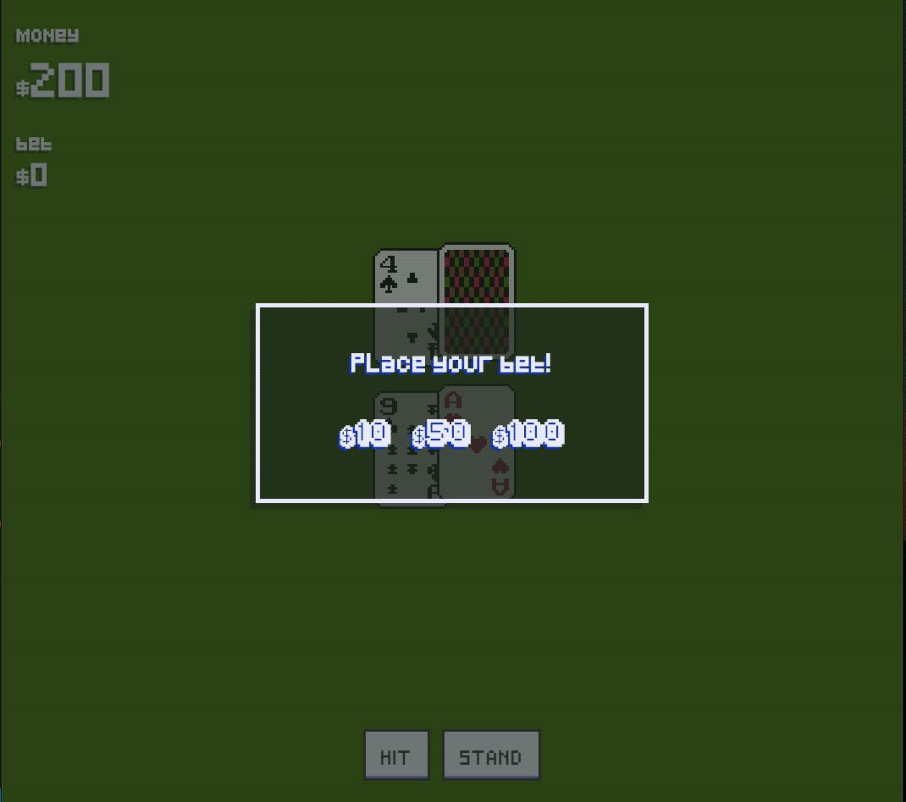

# Table Of Contents

- [Blackjack](#blackjack)
  - [Running the project](#running-the-project)
  - [Screenshots](#screenshots)
    - [Main View](#main-view)
    - [Mobile View](#mobile-view)
  - [Techstack](#tech-stack)
  - [TODO](#todo)

# Portfolio Website

This is a Blackjack game made in React.js using redux and styled components. The player places a bet and then chooses to HIT or STAND.
after the players turn, the dealer (game logics) will reveal the card and hit as long as the dealer has 17 in count.

My goal in this project was to create a fun, easy game, while implementing my newly acquired skills in React, Redux, Styled-Components and Posed animations library.

Demo: SOON

## Running the project

1. Clone the repo.
2. Run `npm install`.
3. Run `npm start`.
4. Navigate to `http://localhost:3000` (or other port based on the message in the console).

## Screenshots

### Main View

Main screen (Fully Responsive)

## Techstack
- React.js
- Redux / Saga
- styled components
- Posed animations

## TODO

- [x] Create decent README.md file.
- [x] Fix all projects descriptions.
- [x] Work page - add data.
- [x] Education page - add data.
- [ ] Add toggle dark/light mode option

